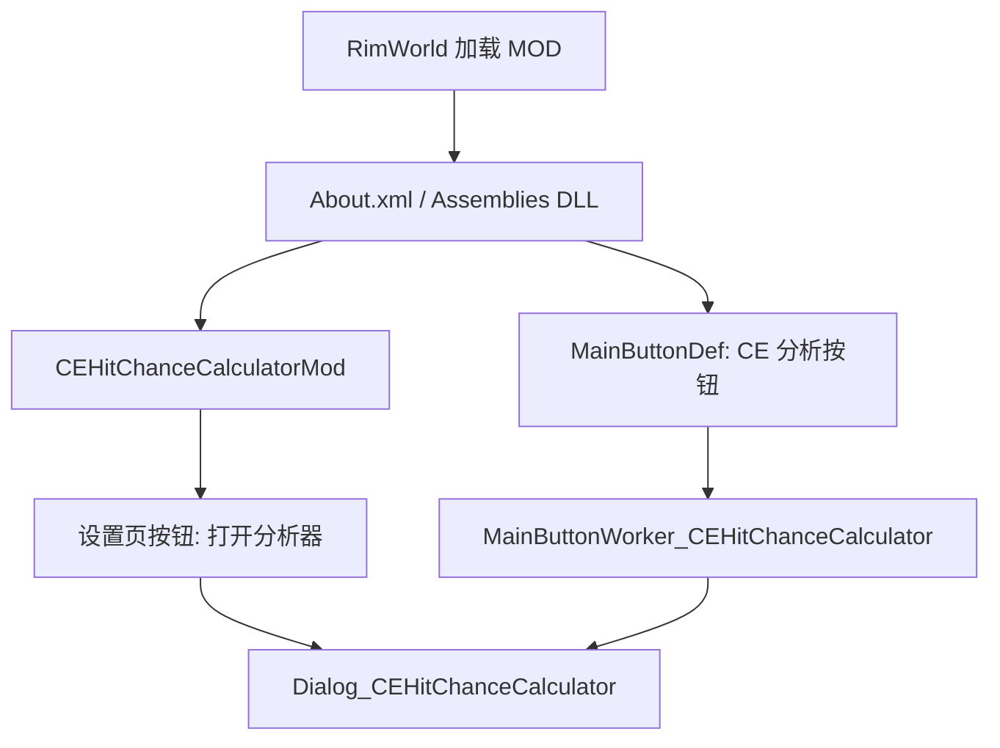
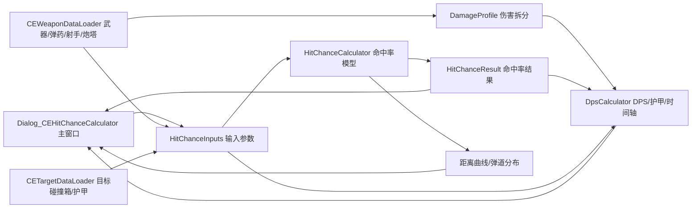
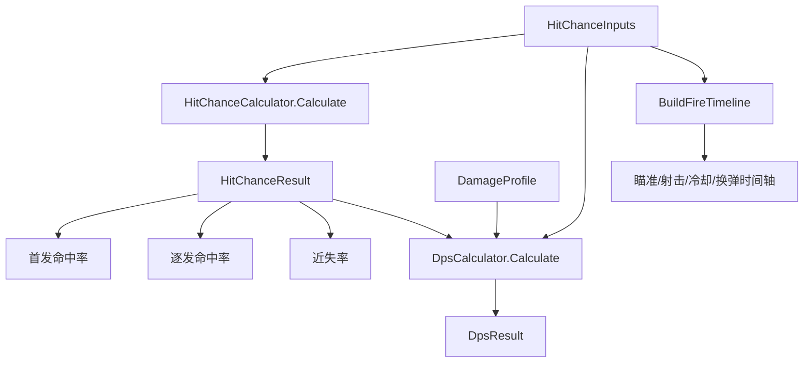

# CE 命中与火力分析器结构图

这份文件用于快速理解当前 MOD 的代码结构。它不是游戏运行必需文件，只是给维护者看的导航图。

## 一句话结构

这个 MOD 的主流程是：

`RimWorld 按钮/设置页` -> `打开分析器窗口` -> `读取武器/射手/目标数据` -> `命中率模型` -> `DPS/护甲模型` -> `UI 报表和弹道图`

## 文件夹结构

```text
CE_HitChanceCalculator
├─ About
│  ├─ About.xml                 MOD 元数据、名称、作者、依赖
│  └─ Preview.png               创意工坊/管理器预览图
├─ Assemblies
│  └─ CEHitChanceCalculator.dll 游戏实际加载的 DLL
├─ Defs
│  └─ MainButtonDefs            底栏按钮入口
├─ Languages
│  ├─ ChineseSimplified         中文翻译
│  └─ English                   英文翻译
├─ Source
│  ├─ CEHitChanceCalculatorMod.cs        设置页与设置保存
│  ├─ MainButtonWorker_CEHitChanceCalculator.cs 底栏按钮点击入口
│  ├─ Dialog_CEHitChanceCalculator.cs    主窗口、UI、缓存、图表绘制
│  ├─ HitChanceModel.cs                  命中率、连发、弹道分布模型
│  ├─ DpsModel.cs                        DPS、时间轴、护甲后伤害模型
│  ├─ CEWeaponDataLoader.cs              读取武器、弹药、射手、炮塔数据
│  ├─ CETargetDataLoader.cs              读取目标碰撞箱和护甲
│  ├─ TestProgram.cs                     本地测试入口，发行版不需要
│  └─ *.csproj                           编译项目文件
├─ Tests                         本地测试输出，发行版不需要
└─ _tmp_ce_decompile*            CE 反编译临时资料，发行版不需要
```

## 运行入口图



## 核心数据流图



## 各文件职责

### `CEHitChanceCalculatorMod.cs`

负责 RimWorld 的 MOD 设置入口和参数保存。  
这里保存的是轻量输入参数，不保存地图对象、Thing 引用或分析结果，所以理论上可以从存档中自由加入和移除。

### `MainButtonWorker_CEHitChanceCalculator.cs`

负责底栏按钮。  
玩家点击按钮后，它会打开 `Dialog_CEHitChanceCalculator`。

### `Dialog_CEHitChanceCalculator.cs`

负责几乎所有界面显示：

- 顶部按钮。
- 当前武器、弹药、射手摘要。
- 核心摘要、首发分析、火力输出、护甲计算、时间轴、弹道分布图。
- 输入框、下拉菜单、目标预设、对比快照。
- 计算缓存和弹道图纹理缓存。

维护重点：

- `DoWindowContents` 会每帧调用，不能在普通绘制路径里做重计算。
- `EnsureCalculated` 负责在输入变化或手动重算时刷新结果。
- `BuildInputSignature` 决定缓存何时失效。新增会影响结果的输入字段时，必须同步加入这里。
- 弹道图用 `Texture2D` 缓存，替换或关闭窗口时必须 `Destroy`。

### `HitChanceModel.cs`

负责“打不打得中”的核心模型：

- CE 公式近似参考。
- 蒙特卡洛首发/连发命中率。
- 枪口摆动、机械散布、后坐力、目标可见度、目标移动预判、射程误差。
- 距离曲线和弹道分布采样。

维护重点：

- `Calculate` 是主入口。
- `RunMonteCarlo` 统计实际命中率、逐发概率和近失。
- `SimulateShot` 是单发采样核心。
- `BuildBallisticDistribution` 给 UI 图表用，不直接参与 DPS。

### `DpsModel.cs`

负责“打中了之后造成多少输出”的模型：

- 持续射速。
- 单匣输出时长。
- 60 秒 DPS。
- 弹匣期望总伤。
- 时间轴。
- 护甲后伤害近似。

维护重点：

- `CalculateShotsPerSecond` 统一处理预热、冷却、换弹和 RPM。
- `BuildFireTimeline` 和 DPS 共用同一套节奏参数，避免时间轴和报表不一致。
- `CalculatePostArmorDamage` 是护甲近似公式。
- `CalculateArmorBreakdown` 是同公式的 UI 解释版。

### `CEWeaponDataLoader.cs`

负责从游戏对象里读取真实武器相关数据：

- 选中武器或炮塔武器。
- 可用弹药和弹丸。
- 武器品质、脚架、定制配件。
- 武器射程、弹速、散布、后坐力、视野效率、换弹、弹匣、射击模式。
- 子弹直击、附加伤害、范围伤害、破片纸面数据。
- 射手属性和炮塔射手属性。

维护重点：

- CE 射击模式有些字段通过反射读，兼容性风险集中在这里。
- `DamageProfileFor` 是伤害拆分入口。
- `WeaponForStats` 会创建临时 clone 读取品质/脚架/配件后的 stat，不应改真实武器。

### `CETargetDataLoader.cs`

负责从选中目标读取：

- 碰撞宽度。
- 垂直高度。
- 代表部位护甲。
- 非 Pawn 目标的护甲 stat。

维护重点：

- Pawn 护甲是代表部位估算，不是完整 CE 逐层衣物结算。
- 体型/碰撞箱读取比手填目标宽高可靠。

## 计算层关系



## 新功能应该放哪里

```text
新输入参数
  -> HitChanceInputs
  -> 设置保存 CEHitChanceCalculatorSettings.ExposeData
  -> UI 输入区 Dialog_CEHitChanceCalculator
  -> BuildInputSignature

新命中机制
  -> HitChanceModel.cs

新伤害或 DPS 口径
  -> DpsModel.cs
  -> Dialog_CEHitChanceCalculator 的显示区

读取游戏内武器/弹药/射手
  -> CEWeaponDataLoader.cs

读取目标体型/护甲
  -> CETargetDataLoader.cs

新增按钮、报表框、图表
  -> Dialog_CEHitChanceCalculator.cs

新增翻译文本
  -> Languages/ChineseSimplified/Keyed/CEHCC.xml
  -> Languages/English/Keyed/CEHCC.xml
```

## 最容易踩坑的地方

1. `Dialog_CEHitChanceCalculator.DoWindowContents` 是逐帧调用的，不能直接塞重计算。
2. 新增影响结果的字段后，忘记更新 `BuildInputSignature` 会导致缓存结果不刷新。
3. 新增保存字段后，忘记更新 `ExposeData` 会导致重开游戏丢设置。
4. 新增显示文本后，忘记中英文 Keyed 翻译会显示翻译 key。
5. `CEWeaponDataLoader` 里反射读取 CE 字段时必须有 fallback，避免 CE 版本变化直接报红。
6. 护甲后伤害是代表部位近似，不要把它写成“完全复刻 CE 护甲结算”。
7. 弹道图 `Texture2D` 必须缓存和销毁，否则会卡顿或积累显存。

